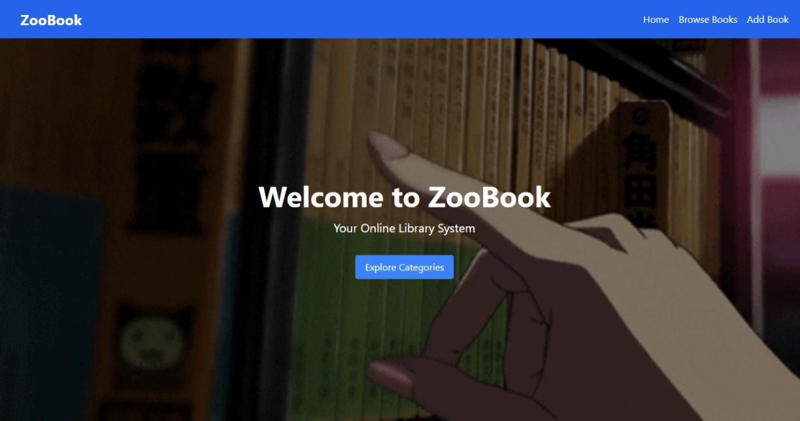
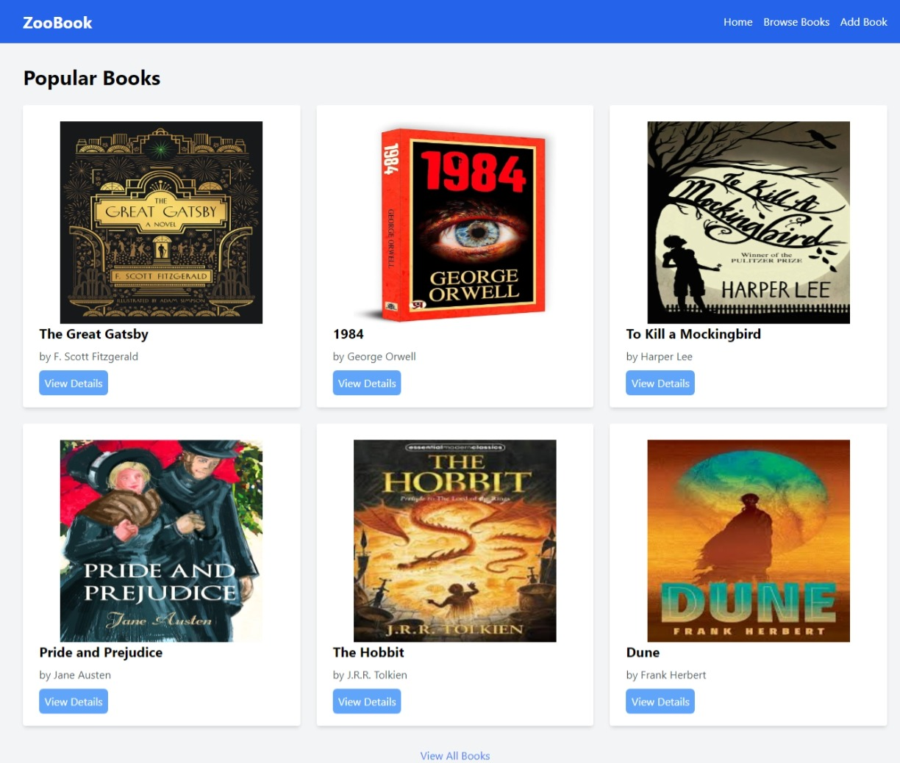
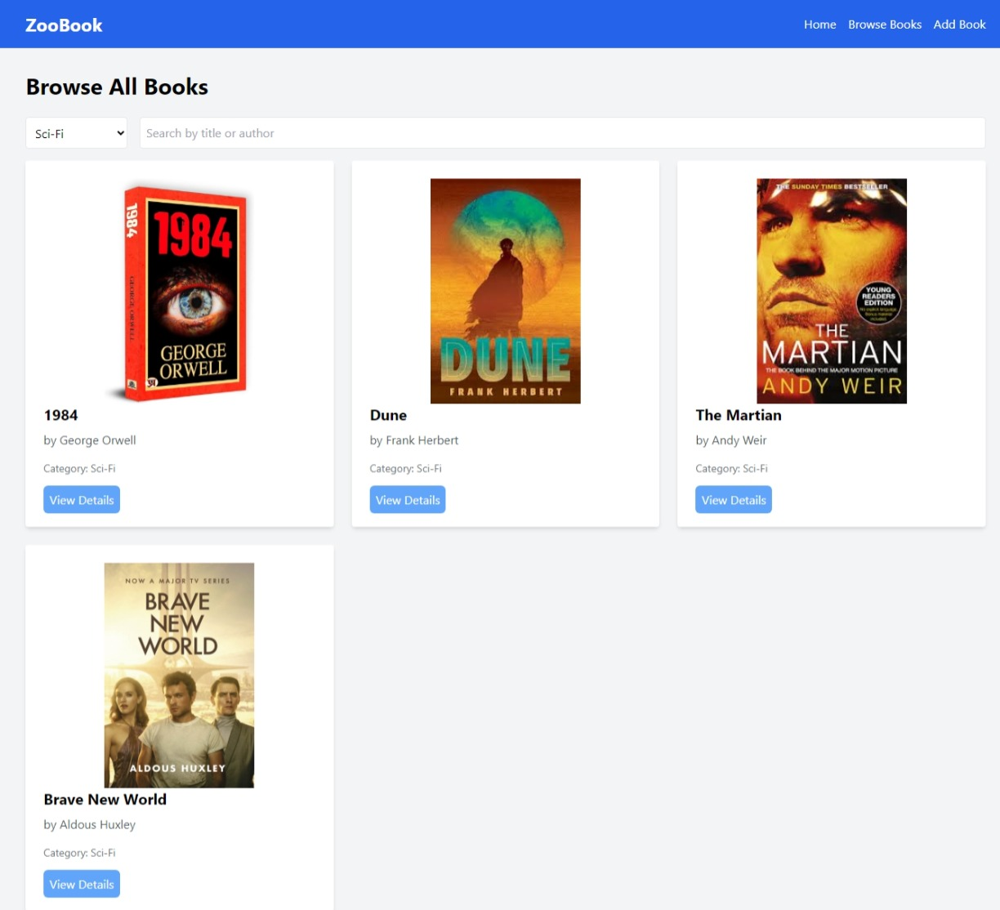
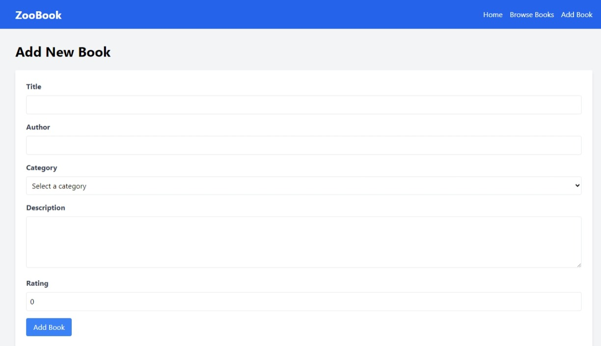
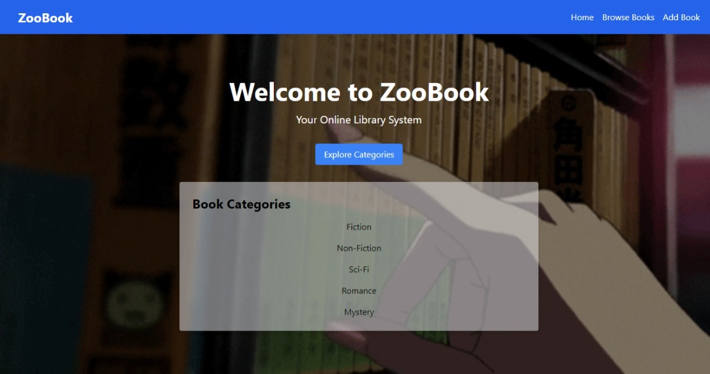
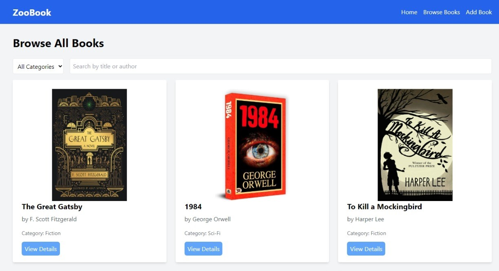
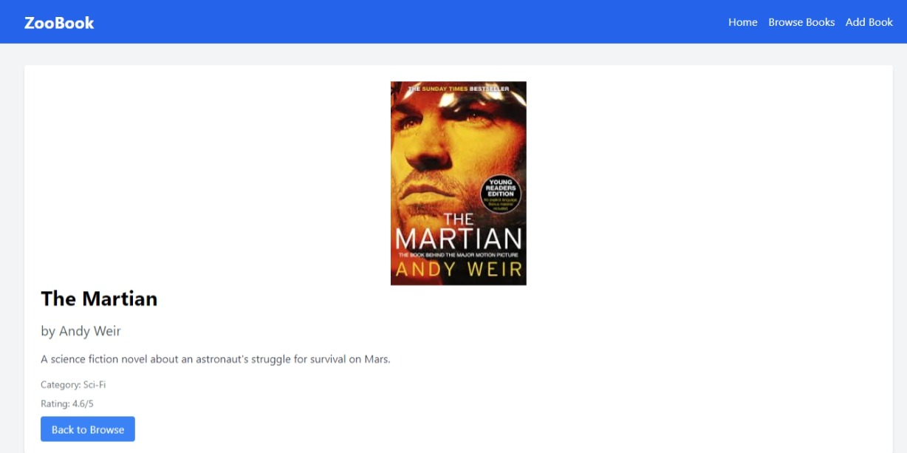
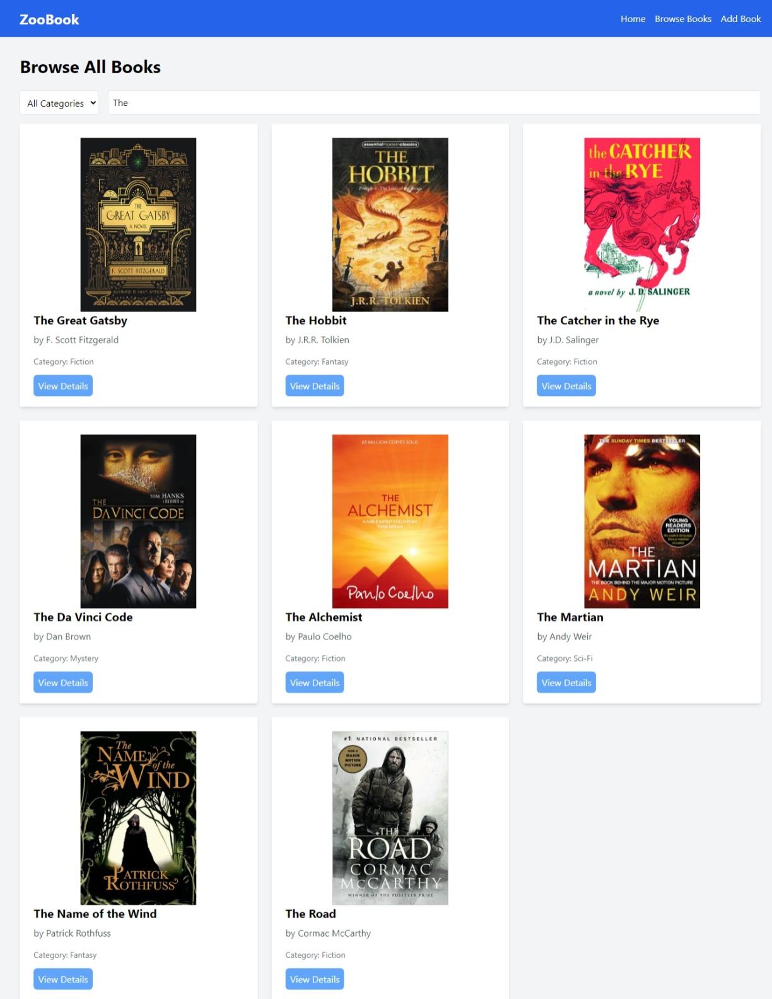
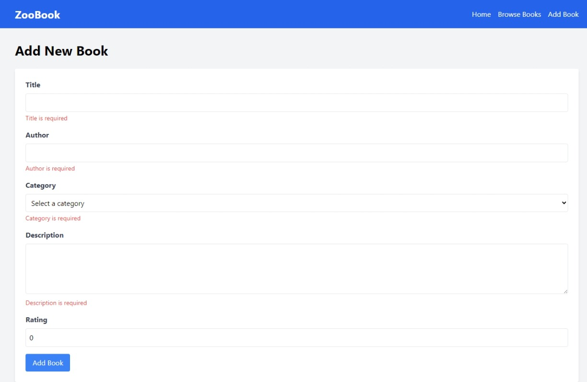

<!-- *if { PageNotFound : 404 Error } Refresh OR Click on Go To Home Buttom  -->
<h2>Live Demo (click here) : <a href="https://sourabh-969.github.io/zooBook/">zooBook</a></h2> 

# ZooBook - Online Library System

ZooBook is an online library system built with React, Vite, and Redux. It allows users to browse books, view book details,Search Functionality(Map & filter out by Book.Title and Book.author) , Filter Functionality(filter by Book.Category) and add new books to the library.

## ScreenShot

<table>
<tr>
<td>
<h2>NavBar</h2>
<h2>HeroPage</h2>
<h2>Home Page</h2>
<h2>Filter Functionality</h2>
<h2>Add Book Functionality</h2>
<h2>Routing Error Handing</h2>
</td>
<td>
<h2>Heropage With Filter</h2>
<h2>Browse Books</h2>
<h2>Book Detail Page</h2>
<h2>Search Functionality</h2>
<h2>AddBook Validation </h2>
</td>
</tr>
</table>

## Technologies Used

- React
- Vite
- Redux Toolkit
- React Router
- Tailwind CSS

## Features

- Browse books by category
- Search for books by title or author
- View book details
- Add new books to the library
- Responsive design

## Project Structure

- `src/components`: Reusable React components
- `src/pages`: Individual page components
- `src/redux`: Redux store and slices
- `src/utils`: Utility functions and mock data

## Major Dependencies

- `@reduxjs/toolkit`: State management
- `react-redux`: React bindings for Redux
- `react-router-dom`: Routing
- `tailwindcss`: Utility-first CSS framework

## Getting Started

To run this application locally :

1. Clone the repository:
>git clone https://github.com/sourabh-969/zooBook.git

2. Install dependencies:
>npm install

3. Start the development server:
>npm run dev
